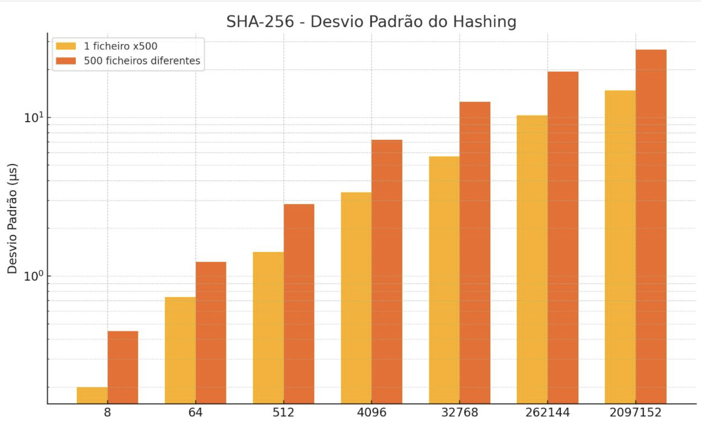
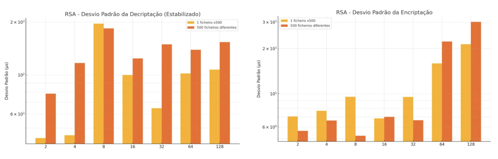
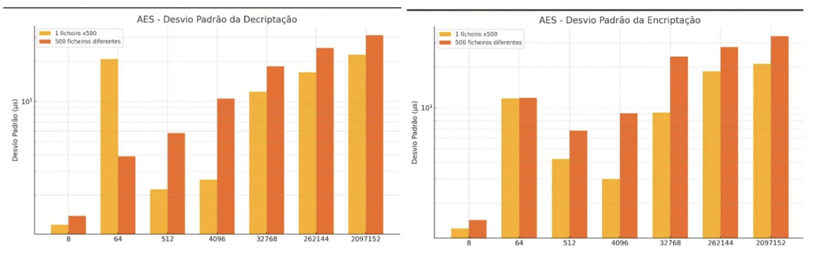
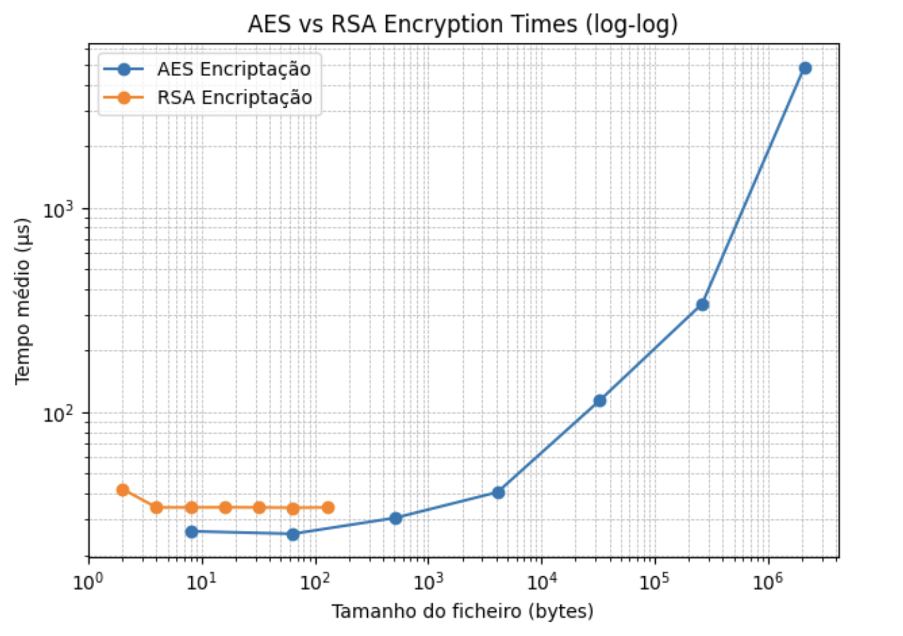
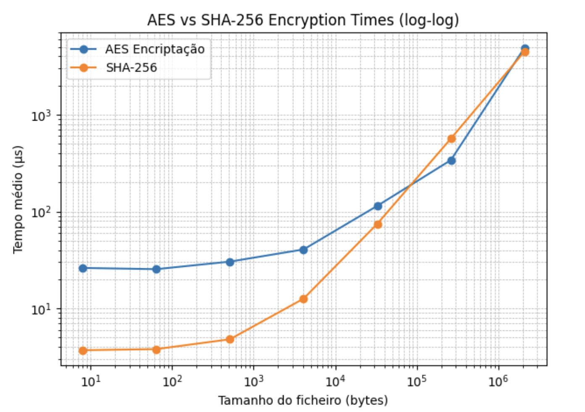
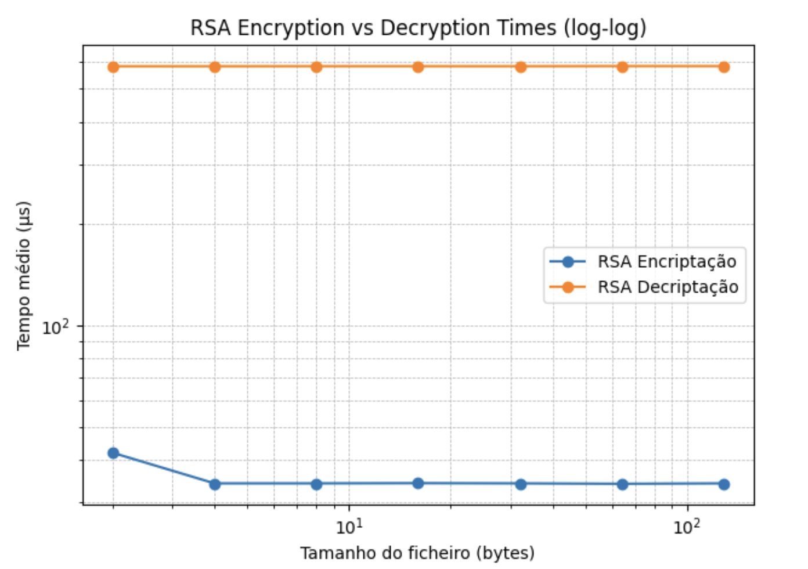

# Cryptography Benchmark

[](https://www.python.org/)
[](./LICENSE)
[](https://matplotlib.org/)
[](https://numpy.org/)

Benchmarking study of **AES**, **RSA** and **SHA‑256** across multiple file sizes and scenarios.  
We measure **encryption**, **decryption** and **hashing** performance, analysing both **speed** and **stability** (standard deviation).

---

## ✨ Project Highlights
- Algorithms: **AES (symmetric)**, **RSA (asymmetric)**, **SHA‑256 (hash)**.
- Scenarios: single file repeated N times vs **N different files**.
- Sizes: from a few bytes up to **MB** scale (log‑log comparisons).
- Metrics: mean **execution time (µs)** and **standard deviation** (stability).
- Deliverables: clean **notebook**, **figures** (in `images/`) and report.

---

## 📂 Repository Structure
```
.
├── data/                          # Test inputs (optional)
├── images/                        # All generated figures (1.png … 15.png)
│   ├── 10.png   # RSA encryption vs decryption (log‑log)
│   ├── 11.png   # RSA standard deviation (enc/dec)
│   ├── 12.png   # SHA‑256 standard deviation (hashing)
│   ├── 13.png   # AES standard deviation (enc/dec)
│   ├── 14.png   # AES vs RSA encryption (log‑log)
│   ├── 15.png   # AES vs SHA‑256 encryption (log‑log)
│   └── …        # other figures (1–9)
├── notebooks/
│   └── cryptography_benchmark.ipynb   # Main notebook (code & analysis)
├── reports/
│   └── cryptography_report.pdf        # Final project report (optional)
├── requirements.txt                   # Python dependencies
├── LICENSE                            # MIT License
└── README.md                          # This file
```

> ℹ️ **Important:** Image links below use the exact filenames in your repo (`images/10.png`, `images/11.png`, …).  
> If an image doesn’t render on GitHub, check that the **filename and extension match exactly** (case‑sensitive).

---

## 📊 Visualizations

### Standard Deviation Analysis
- **SHA‑256 hashing stability**  
  

- **RSA standard deviation (encryption & decryption)**  
  

- **AES Encryption vs Decryption Times (log‑log)**  
  


### Performance Comparisons

- **AES vs RSA Encryption (log‑log)**  
  

- **AES vs SHA-256 Encryption (log‑log)**  
  

- **RSA Encryption vs Decryption Times (log‑log)**  
  

---

## ▶️ How to Run
1. Install **Python 3.11+**.
2. (Optional) Create a virtual environment:
   ```bash
   python -m venv .venv
   source .venv/bin/activate       # macOS/Linux
   .venv\Scripts\activate        # Windows
   ```
3. Install dependencies:
   ```bash
   pip install -r requirements.txt
   ```
4. Launch the notebook:
   ```bash
   jupyter notebook notebooks/cryptography_benchmark.ipynb
   ```

---

## 🔧 Dependencies
- numpy
- matplotlib
- timeit
- jupyter
- ipykernel

---

## 👩‍💻 Author
- Ana Sofia Quintero
- Liliana Silva
- Catarina Abrantes

---

## 📄 License
Licensed under the **MIT License** — see [LICENSE](./LICENSE) for details.
